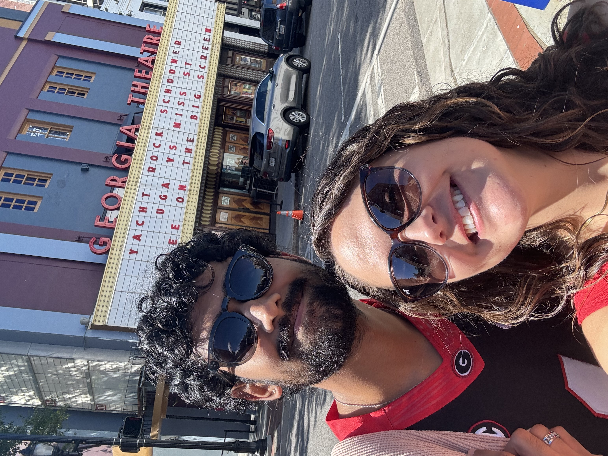

# Brooklynn Loves making websites

Sometimes I use [google](https://www.google.com) to do fun stuff. This is the website for the course [P8105](https://www.p8105.com)
This is an **awesome** website about data science.

**The index.html is always the homepage ** and everything else are pages, but use the  `_site.yml` page to update the whole website themes.

## I love my sweet boyfriend so much!!

If you'd like to learn more about this website, visit [this page](about.html) which is another file in my project folder. 